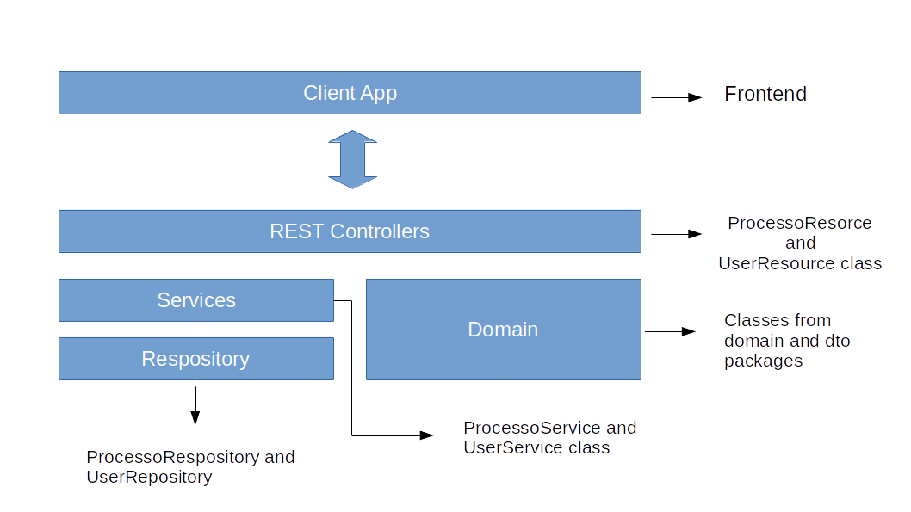

# sofplan-processos

<h2>Technology stack</h2>

<ul>
    <li>Java SE 8</li>
    <li>Spring Boot 2.1.2</li>
    <li>MongoDB server 3.6.3</li>
    <li>NodeJs 8.15.0</li>
    <li>NPM 6.4.1</li>
    <li>Maven 4.15.0-43</li>
</ul>

<h2>Dependencies</h2>

<ul>    
    <li>Webpack 1.14.0</li>
    <li>Webpack Dev Server 1.16.2</li>
    <li>Babel Core 6.22.1</li>
    <li>Babel Loader 6.2.10</li>
    <li>Babel Plugin React Html Attrs 2.0.0</li>
    <li>Babel Plugin Transform Object Rest Spread 6.22.0</li>
    <li>Babel Preset es2015 6.22.0</li>
    <li>Babel Preset React 6.22.0</li>
    <li>Extract Text Webpack Plugin 1.0.1</li>
    <li>Css Loader 0.26.1</li>
    <li>File Loader 9.0</li>
    <li>Boostrap 3.3.7</li>
    <li>Font Awesome 4.7.0</li>
    <li>React 15.4.2</li>
    <li>React DOM 15.4.2</li>
    <li>React Router 3.0.2</li>
    <li>Axios 0.15.3</li>
    <li>Moment 2.10.0</li>
</ul>

<h2>Setting up the development environment</h2>

1. Get the code or clone this repository:
<code>
    git clone https://github.com/DiegoRenan/softplan.git
    cd softplan
</code>

2. Install the required dependencies into frontend

3. Add your database configuration details to 
<code>
    backend/src/main/resources/application.properties
</code>

4. Start the Mongo Server database

5. Start the Spring Boot server into backend directory
<code>
    mvn spring-boot:run
</code>

6. Start the NPM into frontend directory 
<code>
    npm run dev
</code>

<h2>Documentation</h2>

<h3>Architectural Design</h3>

The figure below shows the application layered architecture.

<table width="90%"><tr>
<td valign="top" align="left" width="75%">

</td></tr></table>

